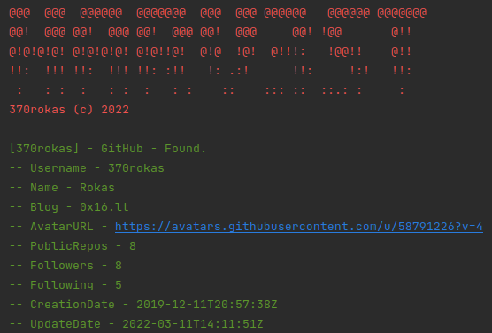
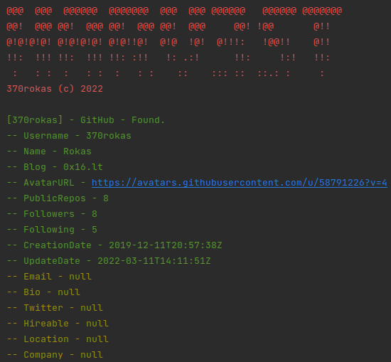

# HARV3ST

A simple Python 3 script for finding data using an Email/Username.

## 🔧 Installation

1. Clone the repo locally.
2. Use the package manager [pip][url_pip] to install the requirements.
```bash
pip install -r requirements.txt
```

## ✨ Basic Usage

Search for usernames `Username1, Username2` and emails `Email1, Email2`:
```bash
harv3st/main.py --username Username1 Username2 --email Email1 Email2
```


Verbose search for usernames `Username1, Username2` and emails `Email1, Email2`:
```bash
harv3st/main.py --username Username1 Username2 --email Email1 Email2
```


## 🤝 Contributing

Pull requests are welcome. For major changes, please open an issue first to discuss what you would like to change.

## 📝 License
This project is licensed under the [MIT][url_mit] license.

[url_pip]: https://pip.pypa.io/en/stable/
[url_mit]: https://choosealicense.com/licenses/mit/